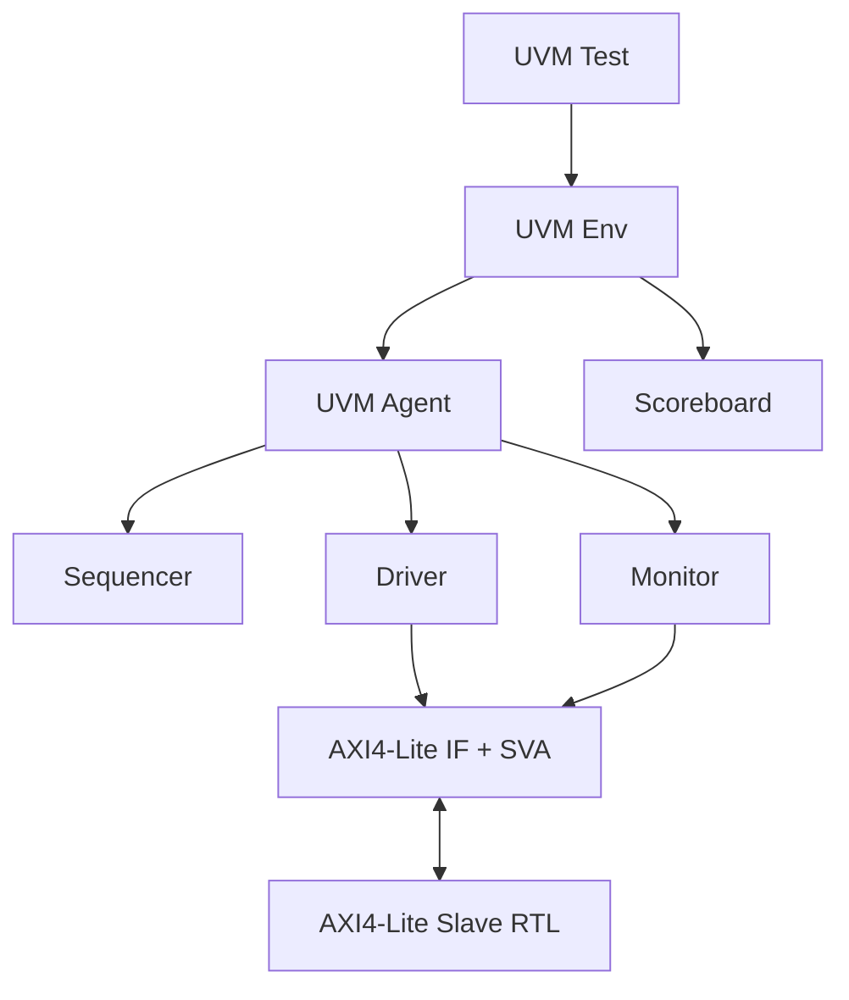

# 🛡️ AMBA AXI4-Lite Slave Verification (UVM & ABV)

Dự án này thực thi mô hình kiểm thử chuyên nghiệp cho **AXI4-Lite Slave** bằng cách kết hợp giữa **UVM (Universal Verification Methodology)** và **ABV (Assertion-Based Verification)**.

## 🌟 Key Highlights
*   **Full UVM Architecture**: Bao gồm Agent, Driver, Monitor, Sequencer, Scoreboard và Environment.
*   **Dual-Layer Verification**: 
    *   **ABV**: 15+ SystemVerilog Assertions (SVA) bắt lỗi Protocol ngay lập tức.
    *   **UVM Scoreboard**: Kiểm tra Data Integrity bằng Associative Array (Sparse Memory).
*   **CRV (Constrained-Random Verification)**: Tự động hóa việc tạo test case ngẫu nhiên có ràng buộc để bao phủ các Corner Case.

## 🏗️ Verification Environment



## 🛠️ Components Table

| Component | Technology | Description |
| :--- | :--- | :--- |
| **Slave RTL** | SystemVerilog | 32-bit register-mapped AXI-Lite slave. |
| **UVM Environment** | SystemVerilog | Modular & Reusable environment. |
| **Assertions (ABV)** | SVA | Immediate & Concurrent checks for handshakes. |
| **Stimulus** | CRV | Constrained-random sequences for address/data. |

## 🚀 How to Run
### 1. Web-based (Recommended)
Dự án được tối ưu hóa cho **EDA Playground**. Cậu chủ chỉ cần copy folder `tb/uvm` lên và chọn simulator là **Synopsys VCS** hoặc **Aldec Riviera-PRO**.

### 2. Local Flow (Open Source)
Sử dụng **Icarus Verilog**:
```bash
# Biên dịch và chạy
iverilog -g2012 -o sim.out rtl/axi4_lite_slave.sv tb/uvm/tb_top.sv
vvp sim.out
```

---
*Phát triển bởi Bì Duy Tân — Sẵn sàng cho các dự án SoC phức tạp.*
