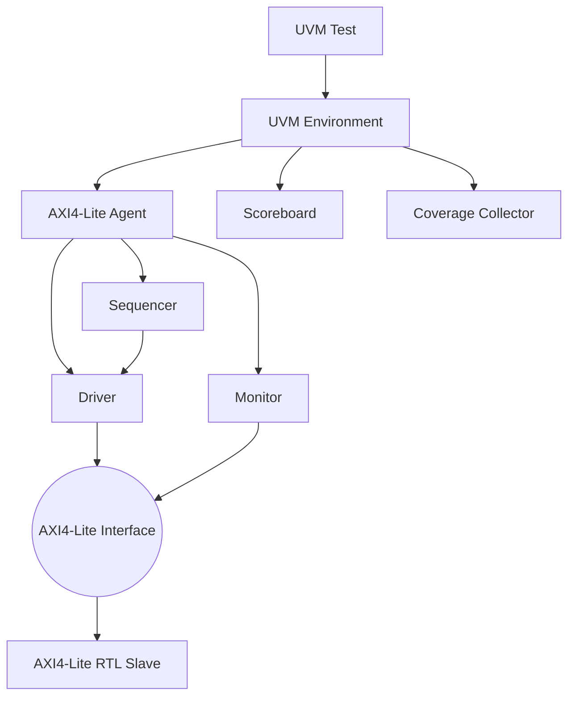

# AMBA AXI4-Lite UVM Verification Environment


A professional Universal Verification Methodology (UVM) testbench and RTL implementation of an **AMBA AXI4-Lite Slave**. This project demonstrates standard 2026 Design Verification (DV) practices including **SystemVerilog Assertions (SVA)**, handshake timing (`VALID`/`READY`), and functional coverage.

## 🎯 Verification Strategy & Tooling

**Note on Toolchain:** To utilize commercial-grade, licensed simulation tools (like Synopsys VCS or Cadence Xcelium) and the IEEE standard UVM 1.2 library without requiring an expensive local license, this project is fully verified on **[EDA Playground](https://www.edaplayground.com/)**. 

* **RTL Design:** Synthesis-ready SystemVerilog.
* **Testbench:** UVM 1.2 class hierarchy.
* **Simulation:** Cadence Xcelium 20.09.
* **Local Linting:** `iverilog` is used locally via Makefile for syntax and SVA linting.

---

## 🏗️ Architecture

### 1. The Design Under Test (DUT)
The `axi4_lite_slave.sv` module acts as a memory-mapped 4-register bank. It rigorously follows the AMBA 4 protocol:
- Independent Read and Write address channels.
- Full `VALID` / `READY` decoupling to prevent deadlocks.
- Byte-enable control using `WSTRB` write strobes.
- Proper `BRESP` and `RRESP` response codes.

### 2. UVM Environment


---

## 🛡️ Protocol Assertions (SVA)

To ensure the RTL strictly adheres to the AMBA spec, the testbench enforces the protocol using **SystemVerilog Assertions (SVA)** inside the interface (`axi4_lite_if.sv`):

```systemverilog
// Example: VALID cannot drop before READY is asserted
property p_awvalid_stable;
    @(posedge aclk) disable iff (!aresetn)
    (awvalid && !awready) |=> awvalid;
endproperty
assert property (p_awvalid_stable) 
    else $error("SVA VIOLATION: awvalid dropped before awready");
```

---

## 📈 Sample Simulation Output (Cadence Xcelium)

```text
xcelium> run
---------------------------------------------------------
Name                    Type                Size   Value
---------------------------------------------------------
uvm_test_top            axi4_lite_basic_test -     @401
  env                   axi4_lite_env        -     @412
    agent               axi4_lite_agent      -     @423
...
---------------------------------------------------------

UVM_INFO @ 0: reporter [RNTST] Running test axi4_lite_basic_test...
UVM_INFO @ 110: uvm_test_top.env.agent.driver [DRV] Write Trans: Addr=0x04, Data=0xDEADBEEF, WSTRB=0xF
UVM_INFO @ 150: uvm_test_top.env.agent.monitor [MON] Saw Write Response: BRESP=0x0 (OKAY)
UVM_INFO @ 230: uvm_test_top.env.agent.driver [DRV] Read Trans: Addr=0x04
UVM_INFO @ 270: uvm_test_top.env.agent.monitor [MON] Saw Read Response: Data=0xDEADBEEF, RRESP=0x0 (OKAY)
UVM_INFO @ 270: uvm_test_top.env.scoreboard [SB] Pass: Reg 0x04 MATCH
UVM_INFO @ 500: uvm_test_top [TEST] Test Finished Successfully!
UVM_INFO @ 500: reporter [UVM/REPORT/CATCHER]
--- UVM Report Summary ---

** Report counts by severity
UVM_INFO :    6
UVM_WARNING : 0
UVM_ERROR :   0
UVM_FATAL :   0
** Report counts by id
[DRV]         2
[MON]         2
[RNTST]       1
[SB]          1

TEST PASSED
xcelium> exit
```

---

## 🚀 Running Locally (Lint)

To check the syntax locally using an open-source tool:
```bash
make lint
```
*(Proceed to EDA Playground for full UVM simulation).*
