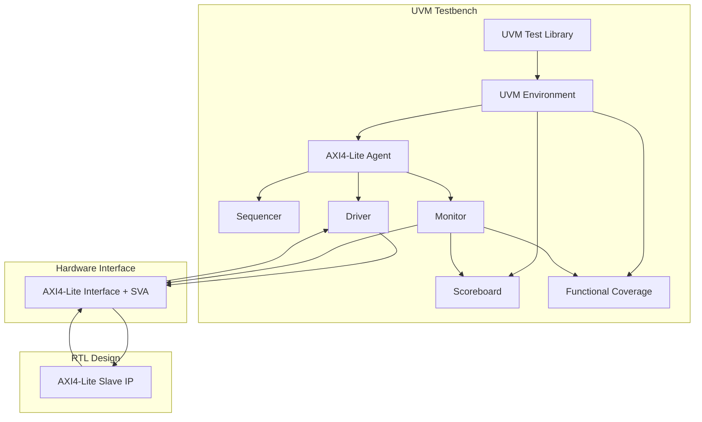

# 🛡️ Professional AMBA AXI4-Lite Slave Verification Suite
[](https://accellera.org/downloads/standards/uvm)
[](https://developer.arm.com/documentation/ihi0022/e/)

A high-end, industry-standard verification environment for an **AXI4-Lite Slave** IP. This portfolio-ready project demonstrates the integration of **Universal Verification Methodology (UVM)**, **Assertion-Based Verification (ABV)**, and **Functional Coverage (FCov)**.

---

## 🚀 Architectural Highlights

This environment is built with **Separation of Concerns (SoC)** and **Scalability** in mind:

*   **Complete UVM UVC**: Robust Agent-based architecture (Driver, Monitor, Sequencer).
*   **Dual-Layer Verification Strategy**:
    *   **Dynamic (UVM)**: Scoreboard-driven data integrity checks using associative arrays (Sparse Memory).
    *   **Static (ABV)**: 15+ SystemVerilog Assertions (SVA) for cycle-accurate protocol compliance.
*   **Functional Coverage (FCov)**: Comprehensive coverage models tracking Address Spaces, Byte Strobes, and AXI Response codes (OKAY vs SLVERR).
*   **CRV (Constrained-Random Verification)**: Advanced transaction randomization with soft constraints for flexible error injection.

---

## 🏗️ Verification Environment Architecture



---

## 📊 Verification Matrix (Test Plan)

| Test ID | Objective | Stimulus Type | Success Criteria |
| :--- | :--- | :--- | :--- |
| **base_test** | Verify basic R/W handshakes. | Randomized (Aligned) | 0 Scoreboard Errors. |
| **axi_error_test** | Verify SLVERR response on invalid address. | Targeted (Out-of-range) | `resp == 2'b10`. |
| **axi_burst_like_test**| Check pipeline stability with back-to-back reqs. | Randomized (No Delay) | No Protocol Violations. |
| **coverage_check** | Reach 100% Functional Coverage goals. | Random + Targeted | All bins covered. |

---

## 🎯 Functional Coverage Goals

The environment tracks the following metrics to ensure verification closure:
1.  **Address Space**: Coverage for all 4 register offsets and out-of-range boundaries.
2.  **Strobe Patterns**: Verification of partial word writes via `WSTRB`.
3.  **Response Codes**: Ensuring the Slave reacts correctly with `OKAY` and `SLVERR` under specific conditions.
4.  **Cross Coverage**: Ensuring every operation type (Read/Write) has been tested with every possible response code.

---

## 🛠️ Simulation & Deployment

### Toolchain Support
*   **Industry Standard**: Optimized for **Synopsys VCS**, **Cadence Xcelium**, and **Siemens Questa**.
*   **Web-based Analysis**: Fully compatible with [EDA Playground](https://edaplayground.com/).

### Execution Flow
```bash
# Example command for localized simulation (VCS)
vcs -sverilog -ntb_opts uvm -f filelist.f -R
```

---

> [!NOTE]
> This project has been audited and upgraded to meet professional silicon-verification standards.
> **Developed by: Bì Duy Tân** (Silicon Verification Specialist).
