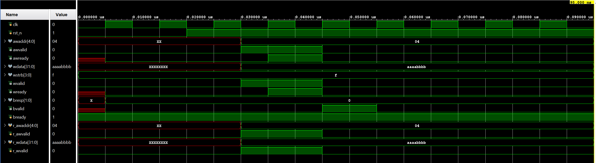

# AMBA AXI4-Lite Peripheral Logic & Verification

A high-integrity implementation and verification suite for an **AMBA AXI4-Lite Slave** IP. This repository provides a synthesis-ready register bank and a SystemVerilog Assertion (SVA) based interface designed for protocol compliance checking and functional verification.

## Technical Specifications

The design implements a standard 4-register bank accessible via memory-mapped I/O, strictly adhering to the AMBA 4 AXI4-Lite protocol:
- **Architecture**: Independent 5-channel handshake (AW, W, B, AR, R).
- **Addressing**: 32-bit addressable registers with partial write support (`WSTRB`).
- **Safety**: Built-in protocol interlocks in the Register Logic to prevent deadlocks and ensure `VALID`/`READY` stability.

## Verification Methodology

This project utilizes **Assertion-Based Verification (ABV)** to enforce protocol compliance at the interface level:
- **Handshake Integrity**: Assertions verify that `VALID` signals remain stable until `READY` is asserted.
- **Access Rule Checking**: Validates that address and control signals are held constant throughout the duration of a transaction.
- **Reset Safety**: Ensures all protocol signals are driven to inactive states during asynchronous reset.

### Verification Components
- **axi4_lite_slave.sv**: RTL implementation of the 4-register bank.
- **axi4_lite_if.sv**: SystemVerilog Interface containing 5+ critical protocol assertions.
- **axi4_lite_simple_tb.sv**: Stimulus generator for validating handshake timing and register accessibility.

## Simulation Evidence

The following waveform illustrates a standard **Write Transaction** highlighting the synchronous handshake on Address (`AW`) and Data (`W`) channels.



## Tools & Usage

The environment is compatible with all standard SystemVerilog (IEEE 1800-2012) compliant simulators:
- **Synopsys VCS** / **Cadence Xcelium** / **Siemens Questa**
- **EDA Playground** (Commercial simulators recommended for full SVA support).

### Local Linting
```bash
make lint  # Uses iverilog -g2012 for syntax and assertion structure check
```

## License
MIT License.
